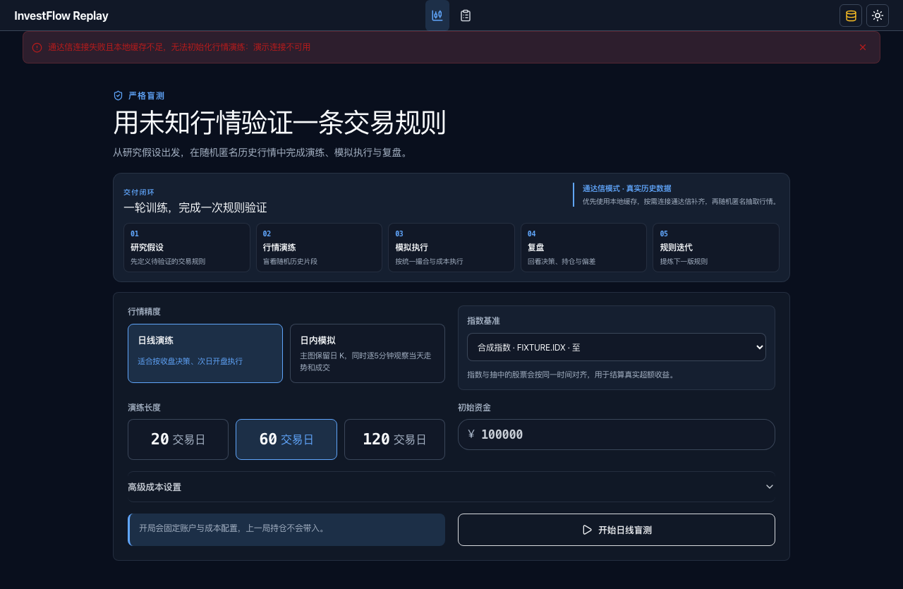

<div align="center">

# InvestFlow Replay

**先把交易规则放进可回放的训练场，再谈真实交易。**

一个本地优先的行情演练与模拟交易工作流：从研究假设出发，完成匿名行情演练、模拟执行、复盘修正，并将每一次决策沉淀为可追溯的策略版本。


[快速开始](#快速开始) · [离线 Demo](#离线-demo-可验证的完整路径) · [证据包](./portfolio-evidence/) · [边界与限制](#边界与限制)

</div>

---

## 这是什么

InvestFlow Replay 面向个人研究与模拟交易。它把“我认为这条规则应该有效”变成一轮可重复执行、记录和复盘的本地演练：行情来自本地缓存或确定性的 synthetic fixture；订单、成交事件、盲评、复盘结论和策略版本进入同一条账本。

它不是市场扫描器，也不做收益承诺。它解决的是规则进入真实交易前，如何先经过一次可观察、可回放、可修正的工程闭环。

## 你实际能验证什么

- **从规则到复盘**：支持日线、1 分钟，以及“日线背景 + 5 分钟执行”的演练；模拟委托、成交事件、历史记录与交易追踪保持关联。
- **行情供给可替换**：正常模式使用通达信与 DuckDB 本地缓存；离线模式改用确定性的 synthetic fixture，不需要网络或个人运行数据。
- **决策可追溯**：会话上下文、行情供给版本、决策依据、订单、盲评、复盘和人工采纳的策略版本保留在本地账本中。

## 离线 Demo：可验证的完整路径

离线演示只替换外部行情供给，Web、Node.js Backend、Python Engine、订单事件、SQLite 账本与复盘流程仍走真实实现；Demo 数据被隔离在项目内的 `.demo-storage/`，不会读取个人交易数据。

<p align="center">
  <a href="./portfolio-evidence/video/InvestFlow-Replay-offline-demo.mp4">
    
  </a>
</p>

<p align="center"><sub>点击图片观看离线 Demo。失败状态也被保留为证据：缓存不足或外部连接失败会被明确说明，而不会伪装成空数据。</sub></p>

完整演示讲稿、失败状态、代表性测试报告、AI Coding 约束与已知限制均在 [`portfolio-evidence/`](./portfolio-evidence/) 中。

## 快速开始

需要 Python 3.10–3.13 与 Node.js 22+。

```bash
./install.sh
./run-demo.sh
```

打开 <http://127.0.0.1:5280/decision/market-replay> 即可体验隔离的离线完整流程。离线 Demo 支持日线 20 / 60 / 120 日演练；1 分钟和日内混合模式需要正常行情供给。

正常模式使用本地行情缓存与通达信服务：

```bash
./run.sh
```

停止或重置 Demo：

```bash
./stop-demo.sh
./reset-demo.sh
```

## 本地系统边界

| 层 | 实现 | 责任 |
| --- | --- | --- |
| Web | Vue 3 + Vite | 演练配置、K 线、下单、复盘与交易追踪 |
| Backend | Node.js | API、演练生命周期、订单事件和账本边界 |
| Engine | Python + FastAPI | 行情准备、解析、缓存和演练场景创建 |
| Market data | 通达信 / easy-tdx 或 synthetic fixture | 在线或离线的可替换行情供给 |
| Storage | DuckDB + SQLite | 行情缓存与应用账本分离 |

运行时数据不提交到仓库：`storage/market/` 保存行情缓存，`storage/app/` 保存演练、订单、复盘和策略账本，`.demo-storage/` 专用于隔离演示。作品集演示应始终使用脱敏的 Demo 存储。

## 验证

```bash
PYTHONPATH=engine .venv/bin/python -m pytest engine/tests
npm test --prefix backend
npm run test:unit --prefix web
npm run test:e2e --prefix web
npm run lint --prefix web
npm run build --prefix web
```

也可以运行完整的作品证据验证；它会在项目外目录启动真实三层离线流程并产出报告：

```bash
./scripts/run-portfolio-verification.sh /tmp/investflow-portfolio-evidence
```

## 边界与限制

- 这是个人研究和模拟演练工具，不构成投资建议；模拟结果不能等同于真实收益。
- synthetic fixture 是程序生成的演示数据，不代表真实行情或任何证券。
- 在线模式依赖通达信服务与本地缓存覆盖；退市证券和分钟行情的可用性不由本项目控制。
- 浏览器 E2E 中有部分 API mock，用于固定前端交互契约；它们不冒充完整三层集成验证。详见 [已知限制](./portfolio-evidence/limitations-and-roadmap.md)。

## 来源

InvestFlow Replay 从 [InvestFlow](https://github.com/DaNN-55/InvestFlow) 独立拆出。AI Coding 工具参与部分实现；产品规则、数据流程、任务拆解、测试验收和迭代由项目作者负责。
