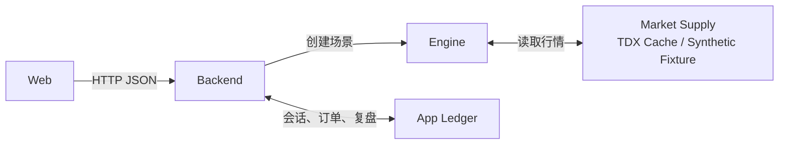

# InvestFlow Replay

InvestFlow Replay 是从 [InvestFlow](https://github.com/DaNN-55/InvestFlow) 独立拆出的行情演练与交易追踪工具。

它把“研究假设—行情演练—模拟执行—交易记录—复盘修正”连接成一个可重复的本地工作流。项目由我独立定义和持续迭代，使用 AI Coding 工具协作完成部分实现，我负责产品规则、数据流程、任务拆解、测试验收和迭代。

## What it demonstrates

- 把研究和策略规则转成可执行的演练流程
- 将外部行情、缓存、演练状态和复盘账本分层管理
- 在外部服务不稳定时明确区分缓存可用、缓存不足和连接失败
- 用单元测试、接口测试和端到端测试验证关键路径
- 将交易事件、复盘结论和策略版本保存为可追溯记录

## Product workflow

~~~
选择基准与演练窗口
  ↓
准备本地行情缓存
  ↓
创建行情演练场景
  ↓
执行模拟交易
  ↓
记录交易事件与决策
  ↓
盲评 / 复盘 / 修正
  ↓
沉淀策略版本
~~~

## Features

- 日线演练、1 分钟演练和日线背景 + 5 分钟执行的混合模式
- 通达信证券列表、股票 / 指数日线、XDXR 除权除息解析与本地前复权
- DuckDB 日线和分钟行情缓存，支持按需下载与增量更新
- 演练会话、交易执行、交易事件和历史记录
- 战法版本、买入许可证、盲评和复盘账本
- 独立交易追踪和本地数据存储

## Architecture

- **Web**：Vue 3 + Vite
- **Backend**：Node.js API 与演练生命周期管理
- **Engine**：Python + FastAPI，负责行情准备和演练场景创建
- **Market data**：在线通达信 / easy-tdx，或离线 synthetic fixture
- **Storage**：DuckDB 行情缓存 + SQLite 应用账本
- **Validation**：Python 测试、Node 测试、Web 单元测试和 Playwright E2E



Backend 调用 Engine 创建演练场景的核心契约如下。示例只使用确定性的 Demo 合成代码；响应为核心字段摘录，省略其他字段、基准 bars 和其余行情 bars。

`POST /internal/replay/scenarios`

请求：

```json
{
  "gameLength": 20,
  "benchmarkCode": "DEMO-INDEX.SYN",
  "seed": 42,
  "interval": "1d",
  "excludedTsCodes": [],
  "recentWindowEndDates": []
}
```

响应核心字段：

```json
{
  "sourceDataVersion": "fixture-demo-market-v1",
  "tsCode": "DEMO004.SYN",
  "symbol": "DEMO004",
  "exchange": "DEMO",
  "name": "Demo 合成标的四",
  "interval": "1d",
  "observationBars": 250,
  "gameLength": 20,
  "benchmark": {
    "code": "DEMO-INDEX.SYN"
  },
  "bars": [
    {
      "sequence": 1,
      "tradeDate": "2020-01-02",
      "open": 76.2084,
      "high": 77.0373,
      "low": 75.7273,
      "close": 76.5006,
      "volume": 1176060
    }
  ]
}
```

## Install and run

需要 Python 3.10–3.13 和 Node.js 22+。正常模式还需要可访问通达信行情服务器的网络。

~~~
./install.sh
./run.sh
~~~

需要与个人数据完全隔离地演示时，使用离线 synthetic fixture 和独立的 `.demo-storage`：

~~~
./run-demo.sh
~~~

`run-demo.sh` 强制使用项目内的 `.demo-storage`，无需网络，也不会连接通达信。Demo 仍经过真实 Backend 会话、订单、事件、SQLite 持久化与复盘流程；只有 Engine 的外部行情供给替换为确定性的合成数据。合成标的与合成指数不对应任何真实证券，不能用于判断真实市场或收益。

重置 Demo 会话与账本时，先停止服务，再运行：

~~~
./stop.sh
./reset-demo.sh
~~~

重置脚本只处理项目内固定的 `.demo-storage`，不会读取或修改 `storage`。

浏览器打开 http://127.0.0.1:5280/decision/market-replay。停止服务运行：

~~~
./stop.sh
~~~

通过 `./run.sh` 启动时仍使用默认 `tdx` provider：首次进入会后台初始化最小可用的日线缓存，分钟线在首次选中具体标的后按需下载。断网时，如果本地缓存足够，系统可以继续使用；缓存不足时会明确返回通达信连接失败及缓存不足原因。`./run-demo.sh` 当前只提供日线 20 / 60 / 120 日演练，不提供 1 分钟或日内混合模式。

## Local data

- storage/market/market.duckdb：日线、复权因子、证券名称、指数和交易日历
- storage/market/minute_replay.duckdb：1 分钟与 5 分钟缓存
- storage/app/replay.sqlite：演练快照、订单、复盘和战法账本
- storage/trade-records/*.json：个人交易追踪记录

运行时数据均被 .gitignore 排除。storage 下的运行数据可能包含个人交易和复盘内容；用于作品集演示时，必须使用独立、脱敏的 Demo 存储边界，不要直接使用个人运行数据。仓库只分享下载 / 解析代码和空库初始化结构，不包含个人交易数据。

## Scope and limitations

- 这是个人研究和模拟演练工具，不构成投资建议。
- Demo synthetic fixture 是程序生成的演示数据，不代表真实市场行情或任何证券。
- 项目不包含市场扫描、股票诊断或量化实验室，这些能力位于主项目的其他模块。
- 不把历史回测或模拟结果直接等同于真实收益。
- 外部行情依赖通达信服务，退市股票覆盖也受当前证券列表能力限制。
- 部分交互和数据覆盖范围仍在持续开发。

## Tests

~~~
PYTHONPATH=engine .venv/bin/python -m pytest engine/tests
npm test --prefix backend
npm run test:unit --prefix web
npm run test:e2e --prefix web
npm run lint --prefix web
npm run build --prefix web
~~~

## Portfolio evidence

阶段 3 作品证据包位于 [`portfolio-evidence/`](portfolio-evidence/README.md)，包含 3–5 分钟离线演示、四类状态契约、代表性测试报告、AI Coding 约束与验收说明，以及已知限制。
