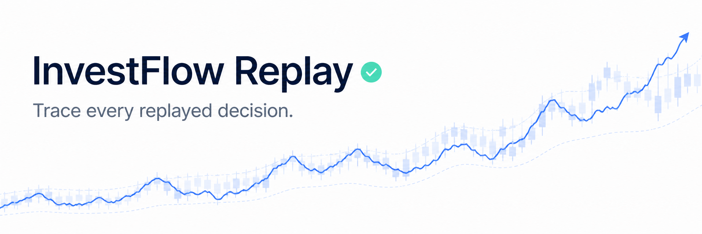
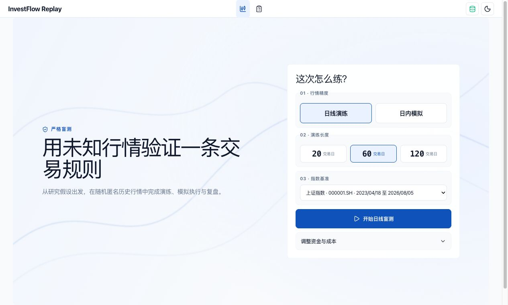
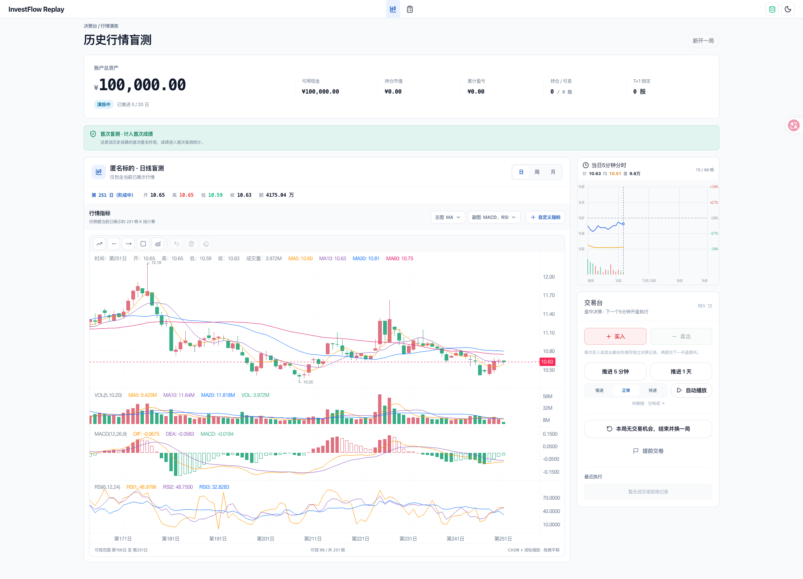

<div align="center">

# InvestFlow Replay

**先把交易规则放进可回放的训练场，再谈真实交易。**

一个本地优先的行情演练与模拟交易工作流：从研究假设出发，完成匿名行情演练、模拟执行、复盘修正，并将每一次决策沉淀为可追溯的策略版本。



[正式界面](#正式界面) · [快速开始](#快速开始) · [验证](#验证) · [边界与限制](#边界与限制)

</div>

---

## 这是什么

InvestFlow Replay 面向个人研究与模拟交易。它将“我认为这条规则应该有效”变成可重复执行、记录和复盘的本地演练：行情来自通达信与 DuckDB 本地缓存；订单、成交事件、盲评、复盘结论和策略版本进入同一条账本。

它不是市场扫描器，也不做收益承诺。它解决的是规则进入真实交易前，如何先经过一次可观察、可回放、可修正的工程闭环。

## 你实际能验证什么

- **从规则到复盘**：支持日线演练，以及“日线背景 + 5 分钟执行”的日内模拟；模拟委托、成交事件、历史记录与交易追踪保持关联。
- **本地行情闭环**：通达信行情进入 DuckDB 本地缓存，日线与 5 分钟数据按需准备。
- **决策可追溯**：会话上下文、行情供给版本、决策依据、订单、盲评、复盘和人工采纳的策略版本保留在本地账本中。

## 正式界面

正式项目使用本地通达信缓存；以下素材来自真实项目的日线与日内模拟配置界面，不包含个人交易记录。

<p align="center">
  
  
</p>

## 快速开始

需要 Python 3.10–3.13 与 Node.js 22+。

```bash
./install.sh
./run.sh
```

打开 <http://127.0.0.1:5180/decision/market-replay>。首次进入会初始化通达信日线缓存；日内模拟使用 5 分钟缓存。

停止服务：

```bash
./stop.sh
```

## 离线演示

安装依赖后，用这一条命令启动完全离线的日线演练：

```bash
./run-demo.sh
```

打开 <http://127.0.0.1:5280/decision/market-replay>。页面会明确标注“离线合成数据”；可完成日线演练、模拟下单、推进、复盘、刷新恢复与历史查看。Demo 使用确定性的合成指数和标的，不连接通达信；会话、订单、复盘和交易追踪账本写入项目内独立的 `.demo-storage/`，不会读取或修改正式 `storage/`。

离线 Demo 只支持 20 / 60 / 120 个交易日的日线演练；日内模拟和真实行情不在此入口提供。停止 Demo：

```bash
./stop-demo.sh
```

如需清空 Demo 的会话与账本，先停止后执行 `./reset-demo.sh`。它只删除 `.demo-storage/`。

## 本地系统边界

| 层          | 实现              | 责任                                  |
| ----------- | ----------------- | ------------------------------------- |
| Web         | Vue 3 + Vite      | 演练配置、K 线、下单、复盘与交易追踪  |
| Backend     | Node.js           | API、演练生命周期、订单事件和账本边界 |
| Engine      | Python + FastAPI  | 行情准备、解析、缓存和演练场景创建    |
| Market data | 通达信 / easy-tdx | 日线与 5 分钟行情缓存                 |
| Storage     | DuckDB + SQLite   | 行情缓存与应用账本分离                |

运行时数据不提交到仓库：`storage/market/` 保存行情缓存，`storage/app/` 保存演练、订单、复盘和策略账本。

## 验证

```bash
PYTHONPATH=engine .venv/bin/python -m pytest engine/tests
npm test --prefix backend
npm run test:unit --prefix web
npm run test:e2e --prefix web
npm run lint --prefix web
npm run build --prefix web
```

## 边界与限制

- 这是个人研究和模拟演练工具，不构成投资建议；模拟结果不能等同于真实收益。
- 在线模式依赖通达信服务与本地缓存覆盖；退市证券和 5 分钟行情的可用性不由本项目控制。
- 离线 Demo 为合成数据，不能据此判断真实市场、证券或收益。
- 浏览器 E2E 中有部分 API mock，用于固定前端交互契约；它们不冒充完整三层集成验证。

## 来源

InvestFlow Replay 从 [InvestFlow](https://github.com/DaNN-55/InvestFlow) 独立拆出。AI Coding 工具参与部分实现；产品规则、数据流程、任务拆解、测试验收和迭代由项目作者负责。
